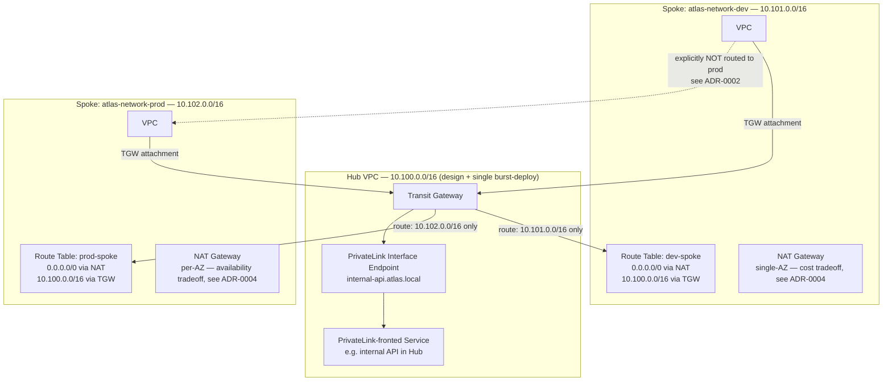

# Atlas Network

> Enterprise connectivity for the Atlas platform: Transit Gateway, PrivateLink, and NAT strategy — designed, validated, and burst-deployed once.

**Status:** Design phase. Terraform modules and burst-deploy evidence are being added incrementally; this README documents the architecture and decisions first, per Atlas engineering standards (write the README before the code).

## Problem Statement

A basic VPC module (see `atlas-foundation/terraform/modules/networking`) is enough for a single, isolated environment. It is not enough once you have more than one VPC that needs to talk to each other, or a service in one account that needs to be privately reachable from another, without transiting the public internet. That's a routing and connectivity problem, not a VPC problem, and it's the one most engineers never get to practice — because in a real org, Transit Gateway and PrivateLink are usually already there by the time a new hire touches them.

Atlas Network solves this at the design level: a hub-and-spoke topology with Transit Gateway as the routing hub, a PrivateLink endpoint for private service exposure, and a documented, cost-justified NAT strategy — all provable through `terraform plan`, diagrams, and a single timed burst-deployment, without an always-on TGW attachment racking up an hourly bill for a year.

This repo is also a deliberate exercise in discipline: Transit Gateway, PrivateLink, and NAT Gateways are the one part of the Atlas platform with **no free tier**. Everywhere else in this platform, "zero-cost" means "genuinely free." Here, it means "spent on purpose, once, for a documented reason, and torn down within the hour." That distinction is the whole point of the phase.

## Overview

Atlas Network builds on top of `atlas-foundation`'s account structure and base VPC module. It does not redefine VPCs, subnets, or route tables from scratch — it consumes the foundation module for that, and adds the layer above it: cross-VPC routing (Transit Gateway), private service exposure (PrivateLink), and internet egress strategy (NAT).

Two spoke VPCs are modeled — `spoke-dev` and `spoke-prod` — specifically so the design has to answer a question a single-spoke demo never forces: **should dev and prod be able to route to each other through the hub by default?** (Answer, and reasoning, in ADR-0002.)

---

## Architecture Diagram

**Read the dotted line carefully** — dev cannot reach prod through the hub. That's not an omission, it's a TGW route table decision (a separate route table per spoke, each with routes only to what it's allowed to see). Full reasoning in ADR-0002.

---

## Design Decisions (ADR)

| ADR | Decision |
|-----|----------|
| [ADR-0001](docs/adr/ADR-0001-cidr-strategy.md) | CIDR allocation for this repo's demo topology (`10.100.0.0/16`–`10.102.0.0/16`), chosen to avoid collision with `atlas-foundation`'s live account ranges |
| [ADR-0002](docs/adr/ADR-0002-tgw-route-segmentation.md) | Transit Gateway route tables are segmented per spoke — dev cannot route to prod by default |
| [ADR-0003](docs/adr/ADR-0003-privatelink-over-vpc-peering.md) | PrivateLink chosen over VPC peering for the internal-API use case, and why peering is still the right call for the dev↔shared-services path |
| [ADR-0004](docs/adr/ADR-0004-nat-strategy-per-environment.md) | Single-AZ NAT for dev (cost), per-AZ NAT for prod (availability) — and the exact dollar delta between them |
| [ADR-0005](docs/adr/ADR-0005-burst-deploy-scope-and-budget.md) | Scope, time limit, and dollar ceiling for the one permitted live burst-deployment in this repo |

*(ADRs are written before their corresponding Terraform, not after — this table will fill in as each is authored.)*

---

## Threat Model

STRIDE-based threat model covering: TGW route table misconfiguration allowing unintended cross-environment traffic, PrivateLink endpoint policy gaps exposing the internal API beyond intended consumers, NAT Gateway as a single point of egress failure, and CIDR overlap risk if this topology is ever attached to a real multi-account TGW. Full document: [`docs/threat-model.md`](docs/threat-model.md).

---

## Technology Choices

| Instead of... | This repo uses... | Tradeoff |
|---|---|---|
| VPC Peering mesh (N² connections) | Transit Gateway (hub-and-spoke) | TGW costs per-attachment/hour and per-GB processed even when idle-ish; peering is free but doesn't scale past a handful of VPCs and has no central route control. Justified in ADR-0003. |
| Public internet path to an internal API | PrivateLink Interface Endpoint | Endpoint costs $/hr + $/GB; the alternative (public ALB + security group allow-list) is cheaper but is a materially worse security posture for an internal-only service. |
| Per-AZ NAT everywhere | Single-AZ NAT in dev, per-AZ in prod | Per-AZ NAT roughly doubles/triples NAT cost for AZ-level fault tolerance. Dev doesn't need that; prod does. Numbers in ADR-0004. |
| Always-on TGW + endpoints | One timed burst-deploy | No free tier exists for any of this. Everywhere else in Atlas, "free" is literal. Here it means "one deliberate, budgeted, time-boxed spend, documented like a change request." |

---

## Cost Model

Designed cost if this topology ran continuously in `us-east-1` (approximate, at time of writing):

| Resource | Unit Cost | Monthly (2 spokes, low traffic) |
|---|---|---|
| TGW attachment (×2) | $0.05/hr each | ~$73/mo |
| TGW data processing | $0.02/GB | traffic-dependent |
| PrivateLink Interface Endpoint | $0.01/hr + $0.01/GB | ~$7/mo + traffic |
| NAT Gateway, dev (single-AZ) | $0.045/hr | ~$33/mo |
| NAT Gateway, prod (per-AZ, ×2) | $0.045/hr each | ~$66/mo |
| **Total, always-on** | | **~$180–220/mo** |

Actual cost incurred building this repo: the single burst-deploy window, budgeted and capped in ADR-0005 — see `docs/cost-model/burst-deploy-actuals.md` for the real Cost Explorer line item once captured.

---

## Deployment Guide

- **Design validation (free, repeatable):** `terraform plan` against each environment in `terraform/environments/`. No `apply` runs in CI, ever — see CI/CD below.
- **Live burst-deploy (one-time, budgeted):** manual, following the runbook in `docs/evidence/burst-deploy/README.md`, executed within the time/dollar ceiling set in ADR-0005, ending in `terraform destroy` with the confirmation output captured.

---

## CI/CD

GitHub Actions runs `terraform fmt -check`, `terraform validate`, and `terraform plan` on every PR across `terraform/environments/*`. There is no `apply` workflow in this repository, by design — matching the same plan-only gate used in `atlas-foundation`.

---

## Security Review

IaC scan results (Checkov / tfsec) committed as artifacts in `docs/evidence/`, generated the same way as `atlas-security`'s scanning pipeline, run against this repo's Terraform.

---

## Cost Analysis

Post burst-deploy, the real (small) Cost Explorer/CUR line items for the deployment window will be pulled into `atlas-finops`'s pipeline as one of its real, non-synthetic data points — see `docs/cost-model/burst-deploy-actuals.md`.

---

## Testing Strategy

Terratest suite validates module inputs/outputs and route table logic statically. Since MiniStack does not support Transit Gateway or PrivateLink (Community edition — verify current support before relying on this), these modules are validated via `terraform validate` + `plan` + manual review rather than an emulated `apply`. That gap is documented, not hidden — see ADR-0005.

---

## Monitoring

VPC Flow Logs enabled on both spokes during the burst-deploy window only, captured as evidence rather than run continuously.

---

## Incident Runbook

Failure scenario: TGW route table misconfiguration causes a routing black hole between a spoke and the hub. Detection, diagnosis (via Flow Logs / Reachability Analyzer), and rollback steps documented in `docs/incident-runbook.md`.

---

## Postmortem Example

To be added after the burst-deploy — any real issue hit during the live window (there is usually at least one) gets a blameless postmortem here, following the same format as `atlas-foundation`'s ADR-driven bug trail.

---

## Benchmarks

AWS Reachability Analyzer output from the burst-deploy window, confirming actual path reachability hub↔spoke and the absence of a path spoke-dev↔spoke-prod (i.e., proving the route segmentation in ADR-0002 actually holds at the network layer, not just on paper).

---

## Future Roadmap

- Add a third spoke (`shared-services`) to demonstrate a hub with an asymmetric routing policy (all spokes → shared, shared → nothing back)
- Evaluate CloudFront + PrivateLink origin pattern once Phase 4 core topology is proven
- Revisit MiniStack/emulator TGW support periodically (see the tooling-churn note in the master plan) — document any switch as an ADR if support appears

## Demo Video

Screen recording of the burst-deploy window — `terraform apply`, Reachability Analyzer run, `terraform destroy` confirmation — to be linked here once captured.