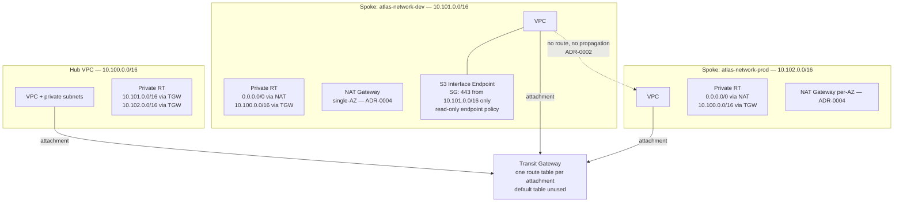
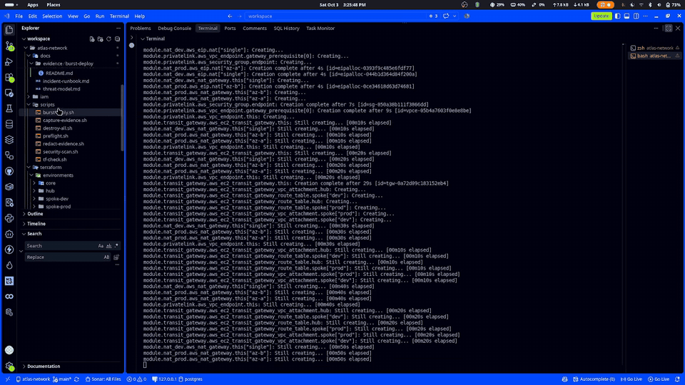

# Atlas Network

> Enterprise connectivity for the Atlas platform: Transit Gateway, PrivateLink, and NAT strategy — designed, validated, and burst-deployed once.

**Status:** Complete. The final burst-deploy ran on 2026-10-03 and was fully torn down: Transit Gateway segmentation is proven on real AWS, with one Reachability Analyzer analysis documented as an open finding (ADR-0011). Several practice burst-deploys came first; ADR-0006 through ADR-0010 document what broke and why.

## Problem Statement

A basic VPC module (see `atlas-foundation/terraform/modules/networking`) is enough for a single, isolated environment. It is not enough once you have more than one VPC that needs to talk to each other, or a service in one account that needs to be privately reachable from another, without transiting the public internet. That's a routing and connectivity problem, not a VPC problem, and it's the one most engineers never get to practice — because in a real org, Transit Gateway and PrivateLink are usually already there by the time a new hire touches them.

Atlas Network solves this at the design level: a hub-and-spoke topology with Transit Gateway as the routing hub, a PrivateLink endpoint for private service exposure, and a documented, cost-justified NAT strategy — all provable through `terraform plan`, diagrams, and a single timed burst-deployment, without an always-on TGW attachment racking up an hourly bill for a year.

This repo is also a deliberate exercise in discipline: Transit Gateway, PrivateLink, and NAT Gateways are the one part of the Atlas platform with **no free tier**. Everywhere else in this platform, "zero-cost" means "genuinely free." Here, it means "spent on purpose, once, for a documented reason, and torn down within the hour." That distinction is the whole point of the phase.

## Overview

Atlas Network builds on top of `atlas-foundation`'s account structure and base VPC module. It does not redefine VPCs, subnets, or route tables from scratch — it consumes the foundation module for that, and adds the layer above it: cross-VPC routing (Transit Gateway), private service exposure (PrivateLink), and internet egress strategy (NAT).

Two spoke VPCs are modeled — `spoke-dev` and `spoke-prod` — specifically so the design has to answer a question a single-spoke demo never forces: **should dev and prod be able to route to each other through the hub by default?** (Answer, and reasoning, in ADR-0002.)

## Designed & Validated

Terraform modules and environments pass `fmt`, `validate` and `plan` in CI, Terratest suites run on every change, Checkov results are archived as CI artifacts, and the architecture, packet flows, threat model and ADRs live in `docs/`.

## Live Demo

Burst-deployed once for validation and torn down (ADR-0005). See [Burst-Deploy Results](#burst-deploy-results-2026-10-03) and the [Demo Video](#demo-video).

---

## Architecture Diagram

```mermaid
graph TB
    subgraph HUB["Hub VPC — 10.100.0.0/16"]
        HUB_VPC[VPC + private subnets]
        HUB_RT[Private RT<br/>10.101.0.0/16 via TGW<br/>10.102.0.0/16 via TGW]
    end

    TGW[Transit Gateway<br/>one route table per attachment<br/>default table unused]

    subgraph DEV["Spoke: atlas-network-dev — 10.101.0.0/16"]
        DEV_VPC[VPC]
        DEV_RT[Private RT<br/>0.0.0.0/0 via NAT<br/>10.100.0.0/16 via TGW]
        DEV_NAT[NAT Gateway<br/>single-AZ — ADR-0004]
        DEV_EP[S3 Interface Endpoint<br/>SG: 443 from 10.101.0.0/16 only<br/>read-only endpoint policy]
    end

    subgraph PROD["Spoke: atlas-network-prod — 10.102.0.0/16"]
        PROD_VPC[VPC]
        PROD_RT[Private RT<br/>0.0.0.0/0 via NAT<br/>10.100.0.0/16 via TGW]
        PROD_NAT[NAT Gateway per-AZ — ADR-0004]
    end

    HUB_VPC -- attachment --> TGW
    DEV_VPC -- attachment --> TGW
    PROD_VPC -- attachment --> TGW
    DEV_VPC --- DEV_EP
    DEV_VPC -.->|no route, no propagation<br/>ADR-0002| PROD_VPC
```

Packet-flow walkthroughs (hub↔spoke, blocked dev→prod, NAT egress, S3 via endpoint): [`docs/diagrams/packet-flows.md`](docs/diagrams/packet-flows.md).

---

## Design Decisions (ADR)

| ADR | Decision |
|-----|----------|
| [ADR-0001](docs/adr/ADR-0001-cidr-strategy.md) | CIDR allocation for this repo's demo topology (`10.100.0.0/16`–`10.102.0.0/16`), chosen to avoid collision with `atlas-foundation`'s live account ranges |
| [ADR-0002](docs/adr/ADR-0002-tgw-route-segmentation.md) | Transit Gateway route tables are segmented per spoke — dev cannot route to prod by default |
| [ADR-0003](docs/adr/ADR-0003-privatelink-over-vpc-peering.md) | PrivateLink chosen over VPC peering for the internal-API use case, and why peering is still the right call for the dev↔shared-services path |
| [ADR-0004](docs/adr/ADR-0004-nat-strategy-per-environment.md) | Single-AZ NAT for dev (cost), per-AZ NAT for prod (availability) — and the exact dollar delta between them |
| [ADR-0005](docs/adr/ADR-0005-burst-deploy-scope-and-budget.md) | Scope, time limit, and dollar ceiling for the one permitted live burst-deployment in this repo |
| [ADR-0006](docs/adr/ADR-0006-iam-policy-gap-practice-burst.md) | IAM policy gap found during the first practice burst-deploy |
| [ADR-0007](docs/adr/ADR-0007-destroy-order-and-core-module-failures.md) | Destroy order, core module bug, manual cleanup |
| [ADR-0008](docs/adr/ADR-0008-iam-policy-drift-and-4th-describe-gap.md) | Repo-vs-live IAM policy drift and a fourth Describe* gap |
| [ADR-0009](docs/adr/ADR-0009-vpc-tgw-routes-and-final-burst-readiness.md) | Missing VPC→TGW routes, Reachability Analyzer permissions, preflight automation, Checkov triage |
| [ADR-0010](docs/adr/ADR-0010-reachability-analyzer-permissions.md) | Reachability Analyzer failed on insufficient permissions; leftover RA paths at teardown |
| [ADR-0011](docs/adr/ADR-0011-reachability-analyzer-dev-to-prod-open-finding.md) | Reachability Analyzer dev→prod analysis failed after the permission fix; cause undetermined, route tables used as segmentation proof |

---

## Threat Model

STRIDE-based threat model covering: TGW route table misconfiguration allowing unintended cross-environment traffic, PrivateLink endpoint policy gaps exposing the internal API beyond intended consumers, NAT Gateway as a single point of egress failure, and CIDR overlap risk if this topology is ever attached to a real multi-account TGW. Full document: [`docs/threat-model.md`](docs/threat-model.md).

---

## Technology Choices

| Instead of... | This repo uses... | Tradeoff |
|---|---|---|
| VPC Peering mesh (N² connections) | Transit Gateway (hub-and-spoke) | TGW costs per-attachment/hour and per-GB processed even when idle-ish; peering is free but doesn't scale past a handful of VPCs and has no central route control. Justified in ADR-0003. |
| Public internet path to an internal API | PrivateLink Interface Endpoint | Endpoint costs $/hr + $/GB; the alternative (public ALB + security group allow-list) is cheaper but is a materially worse security posture for an internal-only service. |
| Per-AZ NAT everywhere | Single-AZ NAT in dev, per-AZ in prod | Per-AZ NAT roughly doubles/triples NAT cost for AZ-level fault tolerance. Dev doesn't need that; prod does. Numbers in ADR-0004. |
| Always-on TGW + endpoints | One timed burst-deploy | No free tier exists for any of this. Everywhere else in Atlas, "free" is literal. Here it means "one deliberate, budgeted, time-boxed spend, documented like a change request." |

---

## Cost Model

Designed cost if this topology ran continuously in `us-east-1` (approximate, at time of writing):

| Resource | Unit Cost | Monthly (2 spokes, low traffic) |
|---|---|---|
| TGW attachments (×3: hub + 2 spokes) | $0.05/hr each | ~$110/mo |
| TGW data processing | $0.02/GB | traffic-dependent |
| PrivateLink Interface Endpoint | $0.01/hr + $0.01/GB | ~$7/mo + traffic |
| NAT Gateway, dev (single-AZ) | $0.045/hr | ~$33/mo |
| NAT Gateway, prod (per-AZ, ×2) | $0.045/hr each | ~$66/mo |
| Public IPv4 (×3 NAT EIPs) | $0.005/hr each | ~$11/mo |
| **Total, always-on** | | **~$225–260/mo** |

Actual cost incurred building this repo: the single burst-deploy window, budgeted and capped in ADR-0005. See `docs/cost-model/burst-deploy-actuals.md` for the real Cost Explorer line item once captured.

---

## Deployment Guide

- **Design validation (free, repeatable):** `terraform plan` against each environment in `terraform/environments/`. No `apply` runs in CI, ever — see CI/CD below.
- **Live burst-deploy (one-time, budgeted):** scripted, following the runbook in `docs/evidence/burst-deploy/README.md`, within the time and dollar ceiling set in ADR-0005: `scripts/preflight.sh` → `scripts/burst-apply.sh` → `scripts/capture-evidence.sh` → `scripts/destroy-all.sh`, which verifies teardown and exits non-zero on any leftover.

---

## CI/CD

GitHub Actions runs `terraform fmt -check`, `terraform validate` and `terraform plan` on every PR across `terraform/environments/*`, plus a Checkov IaC scan that fails the build on new findings. Actions are pinned to commit SHAs and kept current by Dependabot. There is no `apply` workflow in this repository, by design — matching the same plan-only gate used in `atlas-foundation`.

---

## Security Review

Checkov runs on every PR (`scripts/security-scan.sh`, uploaded as a CI artifact). Results are Checkov only; Trivy config-scan is a possible addition. Committed results: [`docs/evidence/security-scan/`](docs/evidence/security-scan/). Accepted findings are listed with justification in ADR-0009.

---

## Cost Analysis

Post burst-deploy, the real (small) Cost Explorer/CUR line items for the deployment window will be pulled into `atlas-finops`'s pipeline as one of its real, non-synthetic data points — see `docs/cost-model/burst-deploy-actuals.md`.

---

## Testing Strategy

Terratest suite validates module inputs/outputs and route table logic statically. Since MiniStack does not support Transit Gateway or PrivateLink (Community edition — verify current support before relying on this), these modules are validated via `terraform validate` + `plan` + manual review rather than an emulated `apply`. That gap is documented, not hidden — see ADR-0005.

The VPC→TGW `aws_route` resources in `environments/core` depend on remote state, so they are covered by `terraform validate` and by the live burst-deploy (route table assertions in `scripts/capture-evidence.sh`), not by Terratest.

---

## Monitoring

No continuous monitoring: the topology exists only for the burst window. Evidence is captured by API instead of Flow Logs — TGW route table contents, Reachability Analyzer analyses, and resource inventories (`scripts/capture-evidence.sh`). Flow Logs are intentionally out of scope (extra IAM surface, no traffic to observe).

---

## Incident Runbook

Failure scenario: TGW route table misconfiguration causes a routing black hole between a spoke and the hub. Detection, diagnosis (via TGW route tables, attachment state and Reachability Analyzer; Flow Logs are not enabled), and rollback steps documented in [`docs/incident-runbook.md`](docs/incident-runbook.md).

---

## Postmortem Example

Real incidents from the practice and final burst-deploys are written up as blameless ADR-postmortems: [ADR-0006](docs/adr/ADR-0006-iam-policy-gap-practice-burst.md) (IAM gap), [ADR-0007](docs/adr/ADR-0007-destroy-order-and-core-module-failures.md) (destroy order, module bug, manual cleanup), [ADR-0008](docs/adr/ADR-0008-iam-policy-drift-and-4th-describe-gap.md) (policy drift), [ADR-0009](docs/adr/ADR-0009-vpc-tgw-routes-and-final-burst-readiness.md) (missing routes found in review), [ADR-0010](docs/adr/ADR-0010-reachability-analyzer-permissions.md) (Reachability Analyzer permissions, leftover paths), [ADR-0011](docs/adr/ADR-0011-reachability-analyzer-dev-to-prod-open-finding.md) (open finding).

---

## Benchmarks

Measured on the 2026-10-03 burst-deploy (`docs/evidence/burst-deploy/2026-10-03/apply-log.txt`):

| Resource | Creation time |
|---|---|
| Transit gateway | 40 s |
| NAT gateways (×3, created in parallel) | 1 m 49 s – 1 m 56 s |
| TGW VPC attachments (×3, created in parallel) | 2 m 13 s – 2 m 23 s |
| S3 Interface Endpoint | 6 m 26 s |
| Full apply, all four environments (`burst-apply.sh`) | 9 min |

The interface endpoint is the slowest resource by a wide margin and sets the length of the `core` apply. Reachability Analyzer confirmed hub→dev and hub→prod are reachable; the dev→prod analysis failed (ADR-0011), so the absence of a dev↔prod path is evidenced by the TGW route tables, not by Reachability Analyzer.

---

## Future Roadmap

- Add a third spoke (`shared-services`) to demonstrate a hub with an asymmetric routing policy (all spokes → shared, shared → nothing back)
- Evaluate CloudFront + PrivateLink origin pattern once Phase 4 core topology is proven
- Revisit MiniStack/emulator TGW support periodically (see the tooling-churn note in the master plan) — document any switch as an ADR if support appears
- Re-run the dev→prod Reachability Analyzer analysis with CloudTrail enabled for the window, to identify the denied action (ADR-0011)

---

## Burst-Deploy Results (2026-10-03)

Final design applied to real AWS (us-east-1), evidence captured, then fully torn down. Raw evidence: [`docs/evidence/burst-deploy/2026-10-03/`](docs/evidence/burst-deploy/2026-10-03/).

| Check | Result | Evidence |
|---|---|---|
| Hub TGW RT learns both spoke CIDRs | ✅ | `tgw-routes-hub.json` |
| Dev RT sees only the hub CIDR (no prod) | ✅ | `tgw-routes-dev.json` |
| Prod RT sees only the hub CIDR (no dev) | ✅ | `tgw-routes-prod.json` |
| Reachability Analyzer hub→dev, hub→prod | ✅ reachable | `reachability-hub-to-*.json` |
| Reachability Analyzer dev→prod | ⚠️ analysis failed, not used as proof | [ADR-0011](docs/adr/ADR-0011-reachability-analyzer-dev-to-prod-open-finding.md) |
| Teardown verified (VPC, TGW, EIP, NAT, endpoint, ENI, RA) | ✅ all empty | `final-*-check.txt` |

Segmentation is proven by the TGW route tables themselves. The one failed analysis and its handling are documented rather than hidden. Earlier attempts and their root causes: ADR-0006 through ADR-0010.

Console screenshots taken while the stack was live: [hub route table](docs/evidence/burst-deploy/2026-10-03/tgw-route-table-hub.png) · [dev route table](docs/evidence/burst-deploy/2026-10-03/tgw-route-table-dev.png) · [prod route table](docs/evidence/burst-deploy/2026-10-03/tgw-route-table-prod.png) · [endpoint](docs/evidence/burst-deploy/2026-10-03/privatelink-endpoint-status.png) · [NAT gateways](docs/evidence/burst-deploy/2026-10-03/nat-gateways.png).

---

## Demo Video

▶ [Full recording (Google Drive, view-only)](https://drive.google.com/file/d/1yjww9BCNU8GPGmnQmeDtHjTMlDnftsHp/view) — 2026-10-03, commit `abc1234`. Apply and teardown are sped up; the clock in the terminal status bar is real UTC time.
