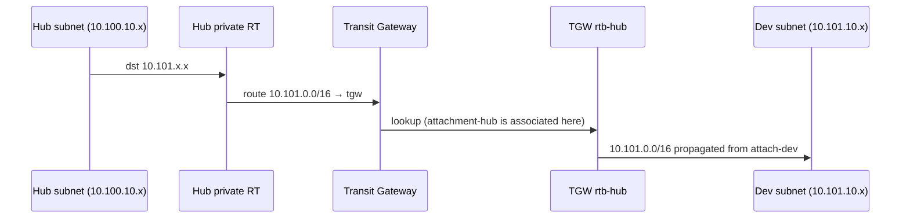
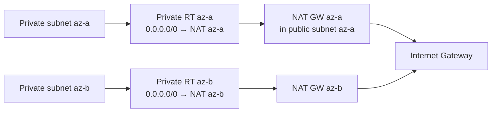
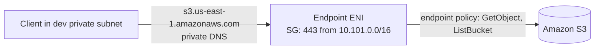

# Packet Flows

## 1. Hub → Dev (allowed)



## 2. Dev → Prod (blocked by design)

```mermaid
sequenceDiagram
    participant D as Dev subnet (10.101.10.x)
    participant DRT as Dev private RT
    D->>DRT: dst 10.102.x.x
    Note over DRT: only 10.100.0.0/16 → TGW and 0.0.0.0/0 → NAT exist
    DRT-->>D: no TGW route; 10.102.x.x is not private-routed to prod
    Note over DRT: even if a route existed, TGW rtb-dev has no 10.102.0.0/16 (no propagation from attach-prod)
```

## 3. Egress via NAT (Prod, per-AZ)



## 4. S3 via Interface Endpoint (Dev)

